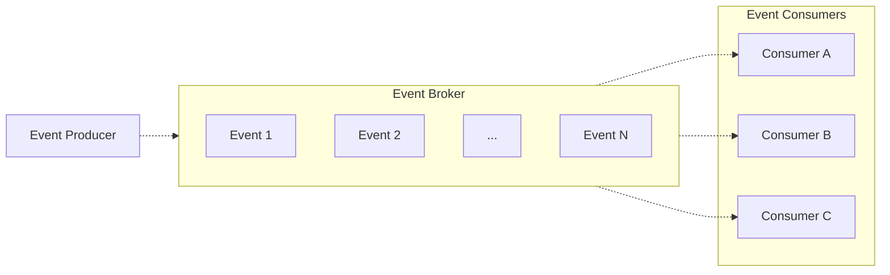
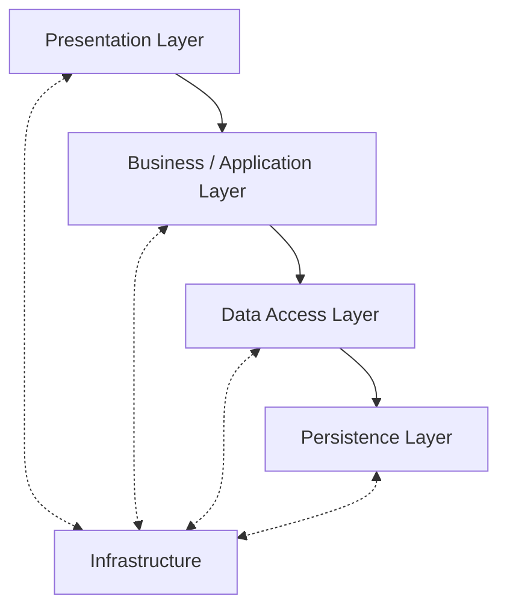
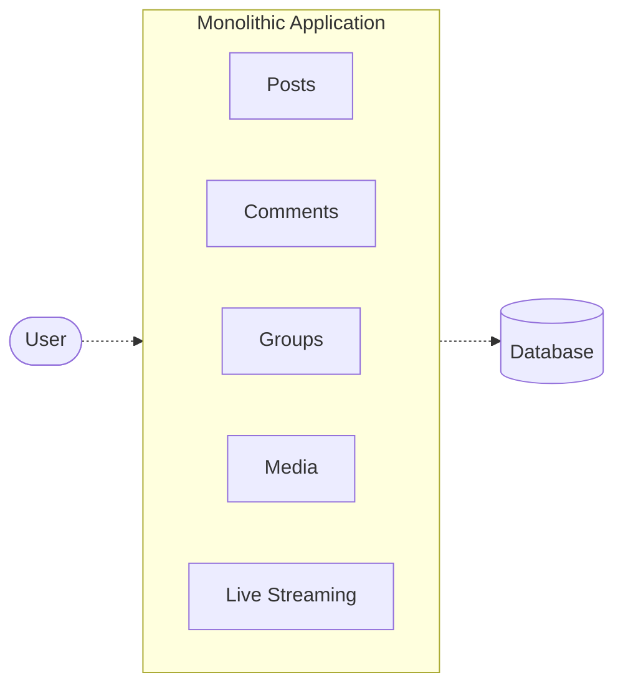
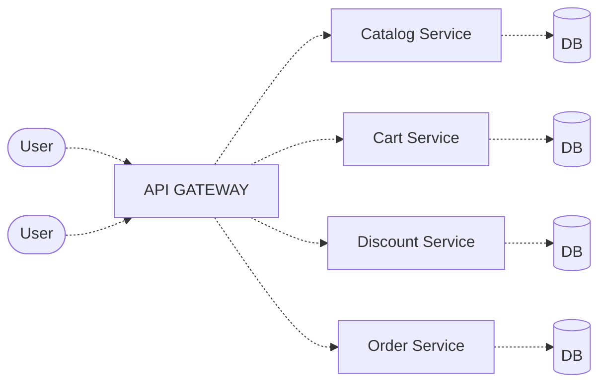
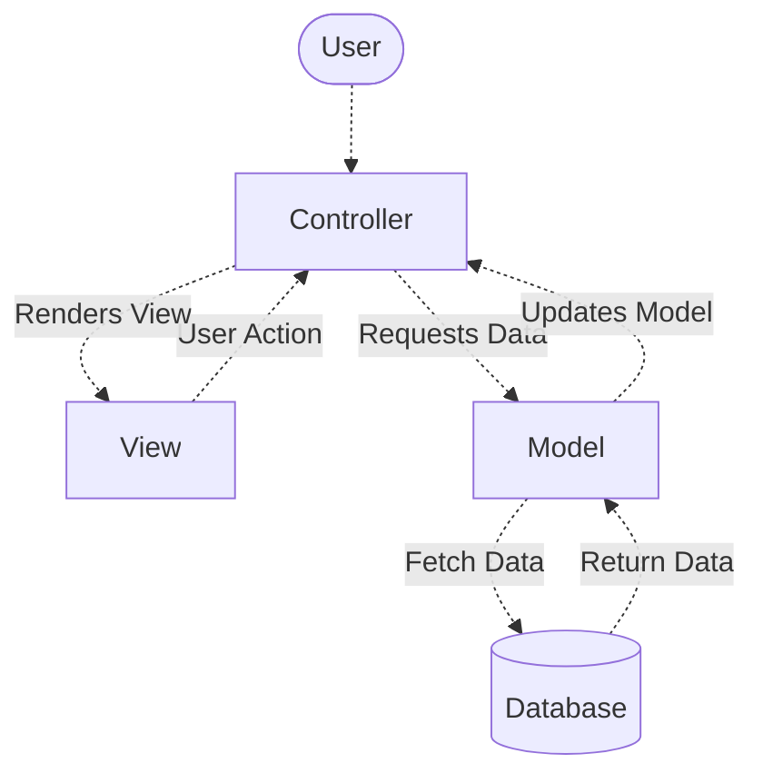
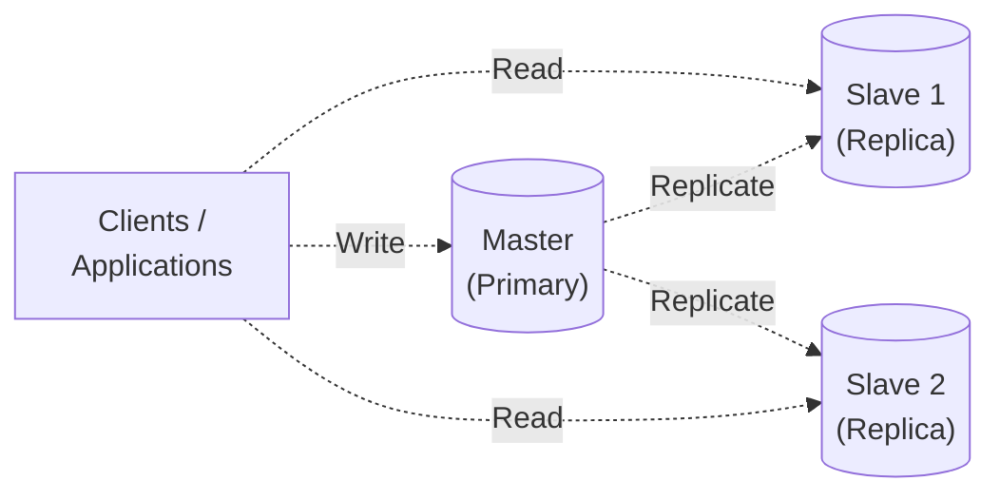

# Software Architecture Patterns

Credited on the source graphic to **Sathish Kumar Subramani**.

Transcribed from `reference/Software-Architecture-Patterns.gif`. Every label in the
graphic appears below; the diagrams are Mermaid redraws of the same six panels.

---

## 01 · Event-Driven

Components communicate through events.

---

## 02 · Layered

Organize system into layers with separation of concerns.

Each layer hands down to the one below it, and every layer talks bidirectionally to
Infrastructure, which spans the full stack.

---

## 03 · Monolithic

All components built and deployed as a single unit.

---

## 04 · Microservices

Application is composed of small, independent services.

Each service owns its own database — four services, four separate `DB` cylinders.

---

## 05 · MVC

Separate application into Model, View and Controller.

---

## 06 · Master-Slave

Distribute read/write workload between master and slaves.

Writes go to the master only. Reads are served by the replicas. Replication flows
master → slave in one direction.

---

## Closing panel

| | |
|---|---|
| 💡 | Understand the patterns. Build better software. |
| ✅ | Choose the right architecture for the right problem. |
| 📊 | Better structure. Scalable solutions. |
